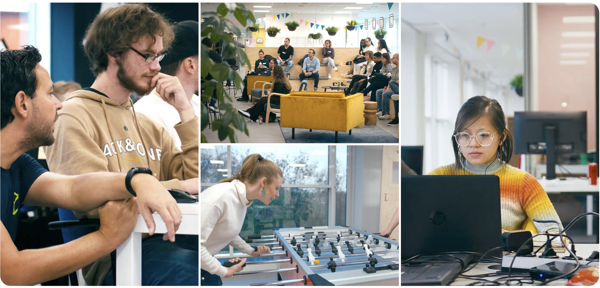

# NOVI homepage remake



In dit project maken we de homepagina van [NOVI Hogeschool](https://www.novi.nl/) na met behulp van herbruikbare React
componenten. Onthoudt: componenten zijn (bijna) altijd in enkelvoud, zo kun je ze gemakkelijker hergebruiken. Met behulp
van properties en callback properties zorgen we ervoor dat we alle soorten en varianten van de content kunnen
ondersteunen.

* Alle algemene stylingregels, zoals kleur-variabelen en font-declaraties staan in `index.css`;
* Styling voor de homepagina - met uitzondering van de componenten zelf - staat in `App.css`;
* Styling voor componenten plaats je in het bijbehorende CSS-bestand;

## How to get started

Als je het project gecloned hebt naar jouw locale machine, installeer je eerst de `node_modules` door het volgende
commando in de terminal te runnen:

```shell
npm install
```

Wanneer dit klaar is, kun je de applicatie starten met behulp van:

```shell
npm run dev
```

of gebruik de WebStorm knop (npm run dev). Open http://localhost:5173 om de pagina in de browser te bekijken. Begin met
het maken van componenten door een nieuwe map te maken in `/components`. Dit component kun je bekijken door deze te
importeren en gebruiken in `App.jsx`.

## Git regels

1. ✨ Gij zult ALTIJD een Pull Request maken ✨
2. ✨ Gij zult pas mergen NA een goedgekeurde review ✨
3. ✨ Gij zult niet pushen naar de `main`-branch ✨(en dat kan ook niet, want die is beveiligd, hihi)

Als je aan een feature werkt, maak je daar netjes je eigen featurebranch voor aan. Ben je tevreden? Dan laat je de PR
controleren door iemand van NOVI.